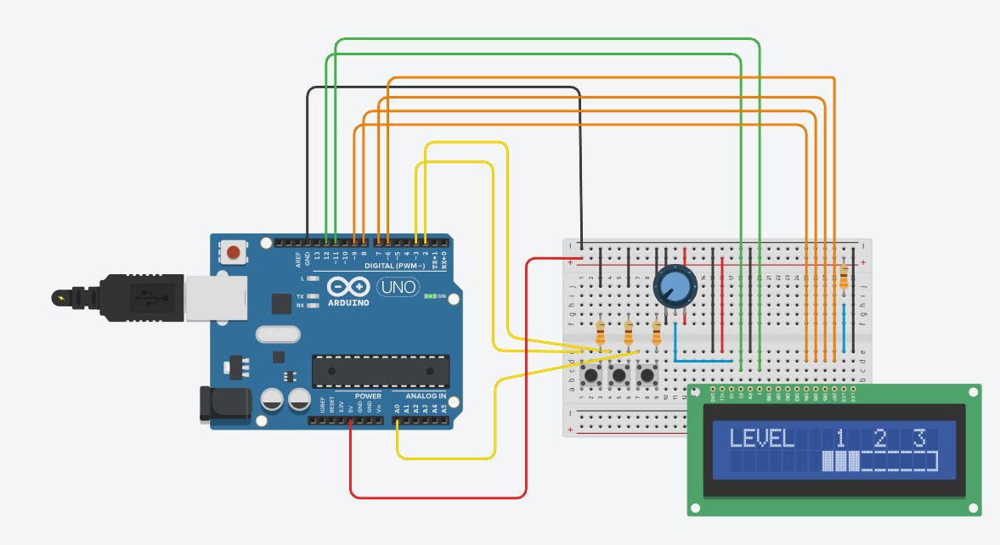
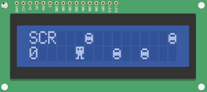

# Arduino Robot Endless Runner
This is my Arduino hobby project, which I have developed independently without relying on any tutorials.

The goal of the game is to keep the robot alive for as long as possible, 
avoiding obstacles.

## Circuit ##

## How to play ## 
1. Choose your level with button on the right.

One click  | Double click  | Hold
---------- |---------------| -------------
level up   | level down    | start the game

2. Game starts

3. Control the robot

Left button  | Middle button | 
-------------|---------------| 
move up      | move down     |

The speed of the enemy is scaling every 10 points, but the score gain increases as well.

